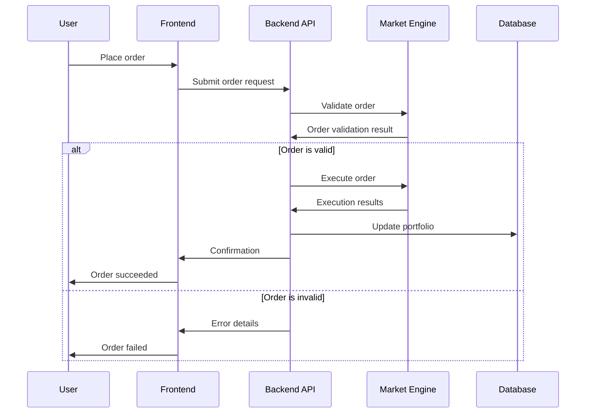
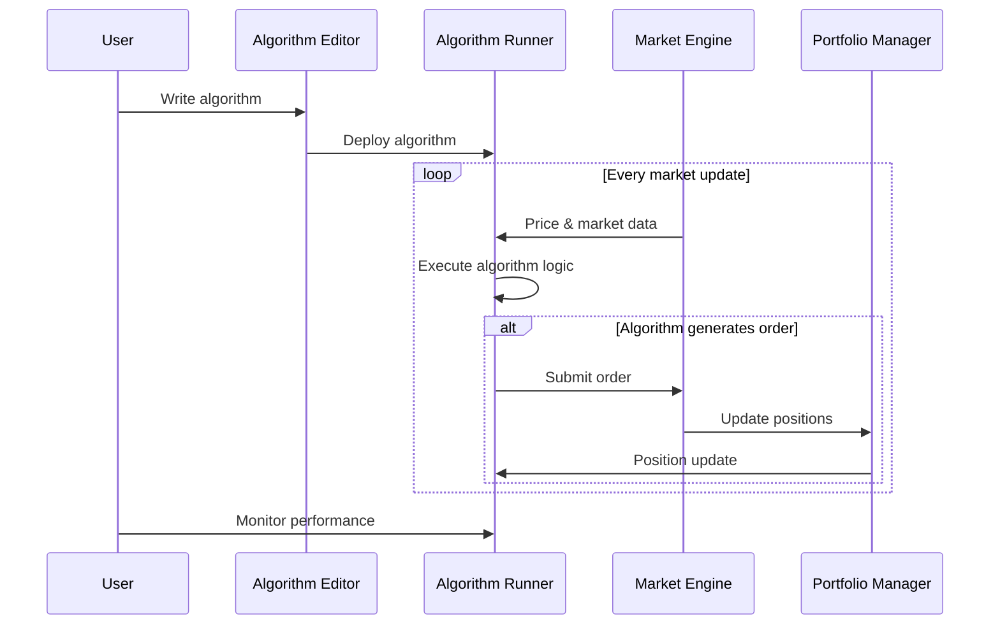

# Data Flow

This page describes how data moves through the candlz system.

## Trading Flow

The trading flow describes how a user's order moves through the system:

1. User places an order in the frontend (Electron UI)
2. The frontend sends the order to the FastAPI backend
3. The backend validates and processes the order
4. The market simulation engine updates prices and order books
5. The backend updates the user's portfolio and returns results to the frontend
6. The frontend displays updated portfolio and trade status

## Algorithm Execution Flow

How player-created algorithms interact with the system:

1. User writes and deploys an algorithm in the Algorithm Lab
2. The backend runs the algorithm in a sandboxed environment
3. On each market update, the algorithm receives new data
4. The algorithm can place orders, which are processed like manual trades
5. Results and logs are sent back to the frontend for review

