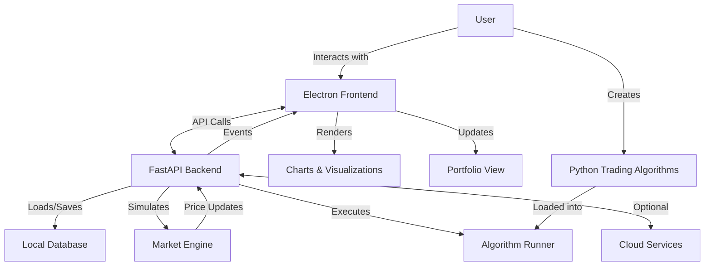
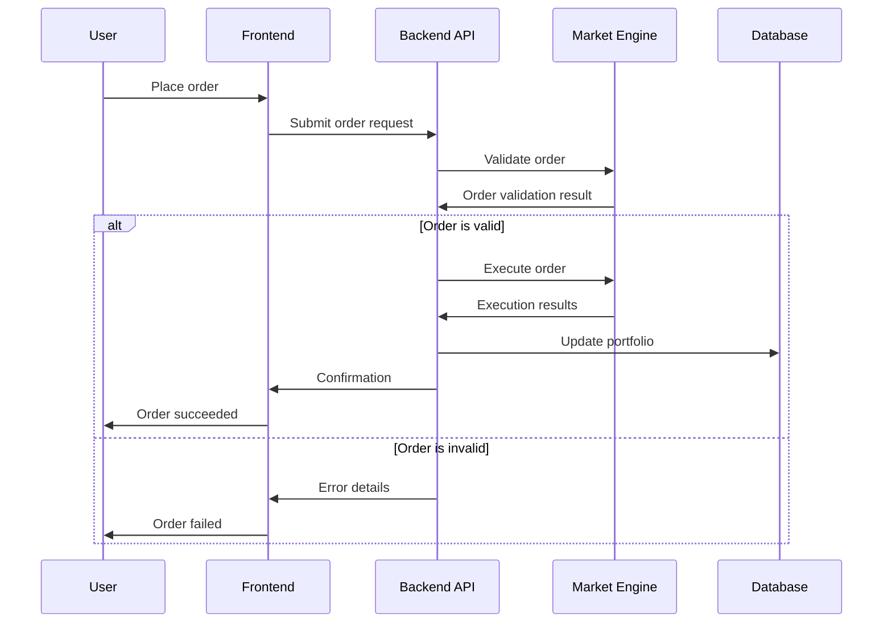
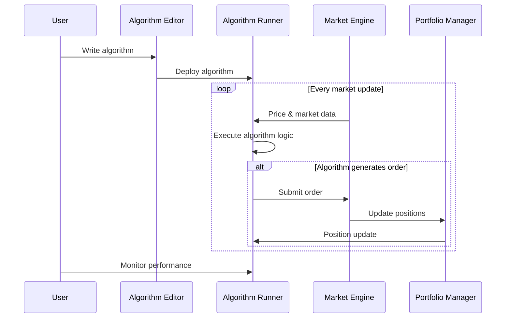

# System Overview

This document provides a technical overview of the candlz trading game architecture, detailing how the system is designed to deliver a seamless, high-performance trading experience with powerful algorithmic capabilities.

## Architecture Philosophy

The candlz architecture follows these design principles:

1. **Separation of Concerns**: Frontend and backend with clear responsibilities
2. **Local-First**: Core functionality works without internet connection
3. **Performance-Focused**: Optimized for real-time market simulation
4. **Extensibility**: Modular design for future expansion
5. **Security**: Player algorithms run in sandboxed environments

## High-Level Architecture

The game is built on a hybrid architecture combining Electron for the frontend and FastAPI for the backend:

## Core Components

### Frontend (Electron)

The Electron-based frontend provides a responsive, desktop-class user interface:

#### Key Frontend Components

- **Main Process**: Handles window management and system integration
- **Renderer Process**: Manages the UI components and user interaction
- **Trading Interface**: Charts, order entry, portfolio view
- **Algorithm Editor**: Code editing environment for trading algorithms
- **Settings Manager**: Configuration and preferences
- **Notification System**: Alerts and status updates

#### Frontend Technologies

- **Electron**: Cross-platform desktop framework
- **React**: UI component library
- **TradingView Charting Library**: Professional-grade charts
- **Monaco Editor**: Code editing component
- **D3.js**: Data visualization for portfolio analytics

### Backend (FastAPI)

The Python-based FastAPI backend handles all game logic and data processing:

#### Key Backend Components

- **Market Simulation Engine**: Generates realistic market data
- **Order Execution System**: Processes trades and updates portfolios
- **Algorithm Runner**: Executes player-created trading algorithms
- **Data Management**: Stores and retrieves game state
- **Event Generator**: Creates economic and market events
- **Analytics Engine**: Calculates performance metrics

#### Backend Technologies

- **FastAPI**: High-performance API framework
- **Pandas**: Data analysis and manipulation
- **NumPy**: Numerical computing
- **SQLAlchemy**: Database ORM
- **Pydantic**: Data validation
- **asyncio**: Asynchronous I/O

## Data Flow

### Trading Flow

The sequence of events in a typical trading operation:

### Algorithm Execution Flow

How player-created algorithms interact with the system:

## Component Details

### Market Simulation Engine

The core system that creates realistic market behavior:

- **Price Generation**: Creates credible price movements
- **Event Processing**: Simulates market reactions to events
- **Order Book Simulation**: Realistic order matching
- **Time Management**: Controls game time progression
- **Volatility Modeling**: Generates appropriate market volatility

### Algorithm Runner

Executes player-created trading algorithms safely:

- **Sandbox Environment**: Isolated execution context
- **API Access**: Controlled interface to market data
- **Resource Limits**: CPU and memory constraints
- **Performance Monitoring**: Tracks algorithm efficiency
- **Error Handling**: Graceful failure management

### Data Management

Handles persistent storage of game state:

- **Local Database**: SQLite for standalone operation
- **Cloud Sync**: Optional online backup and synchronization
- **Save States**: Multiple game profiles
- **Data Compression**: Efficient storage of market history
- **Import/Export**: Trading data portability

## Technical Requirements

### System Requirements

- **Operating System**: Windows 10+, macOS 10.15+, Linux (major distributions)
- **Processor**: Dual-core CPU (quad-core recommended for algorithmic trading)
- **Memory**: 4GB RAM minimum (8GB+ recommended)
- **Storage**: 500MB for application + variable space for market data
- **Graphics**: OpenGL 2.0+ compatible
- **Network**: Internet connection for leaderboards and updates (optional)

### Development Requirements

For players creating trading algorithms:

- **Python Knowledge**: Basic understanding of Python syntax
- **Algorithm Editor**: Built-in editor or external IDE
- **Documentation**: Comprehensive API reference
- **Examples**: Template algorithms for different strategies
- **Testing Framework**: Backtesting and simulation tools

## Deployment Architecture

### Standalone Mode

The default deployment configuration:

- Electron frontend and FastAPI backend run on the same machine
- Local database stores all game data
- Offline operation with optional online features

### Cloud-Connected Mode

Enhanced configuration with online features:

- Core game runs locally
- Leaderboard data syncs with cloud services
- Optional backup of trading history and algorithms
- Global events received from central service

## Performance Optimization

Techniques used to ensure smooth operation:

- **Data Streaming**: Efficient transfer between frontend and backend
- **Incremental Updates**: Partial data updates to minimize overhead
- **Lazy Loading**: On-demand resource initialization
- **Background Processing**: Heavy computations run in separate threads
- **Memory Management**: Careful control of historical data retention

## Security Considerations

Measures to ensure system integrity:

- **Algorithm Sandbox**: Isolated execution environment for user code
- **Input Validation**: Strict validation of all user inputs
- **Resource Limits**: Prevention of excessive resource consumption
- **Error Isolation**: Failures contained without affecting core game
- **Local Storage**: Sensitive data kept on user's machine

## Extensibility

The architecture supports future expansion:

- **Plugin System**: Framework for adding new features
- **Asset Class Expansion**: Infrastructure for new tradable assets
- **API Extensions**: Versioned API for backward compatibility
- **UI Customization**: Themeable interface components
- **Algorithm Library**: Expandable set of algorithm capabilities

## Integration Points

How candlz connects with external systems:

- **Cloud Leaderboards**: Online ranking system
- **Community Sharing**: Algorithm template exchange
- **Data Import/Export**: Trading data portability
- **Notification Systems**: Email and mobile alerts
- **Account Linking**: Optional cloud account integration

## FastAPI Backend Highlights

The FastAPI backend provides several advantages:

- **Asynchronous Processing**: Handle thousands of algorithm operations efficiently
- **Self-Documenting API**: OpenAPI documentation generated automatically
- **Type Safety**: Pydantic models ensure data integrity
- **Performance**: Near-native speed for critical operations
- **Python Ecosystem**: Access to rich data science and finance libraries

## Electron Frontend Highlights

The Electron frontend delivers a premium experience:

- **Native Performance**: Hardware-accelerated UI rendering
- **Cross-Platform**: Consistent experience across operating systems
- **Rich UI Capabilities**: Advanced visualizations and animations
- **Local System Access**: Direct interaction with local resources
- **Offline Functionality**: Full operation without internet connection

---

The candlz architecture combines the strengths of Electron and FastAPI to create a high-performance trading simulation that supports both casual players and advanced algorithm developers. This hybrid approach delivers the responsiveness of a desktop application with the powerful data processing capabilities needed for realistic market simulation.
